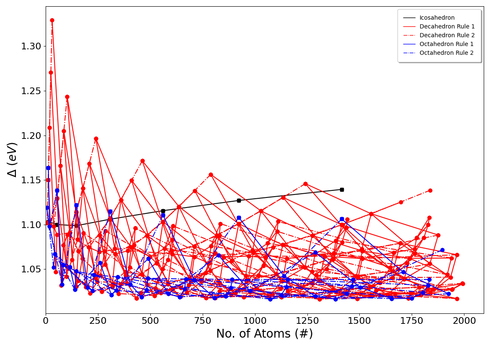
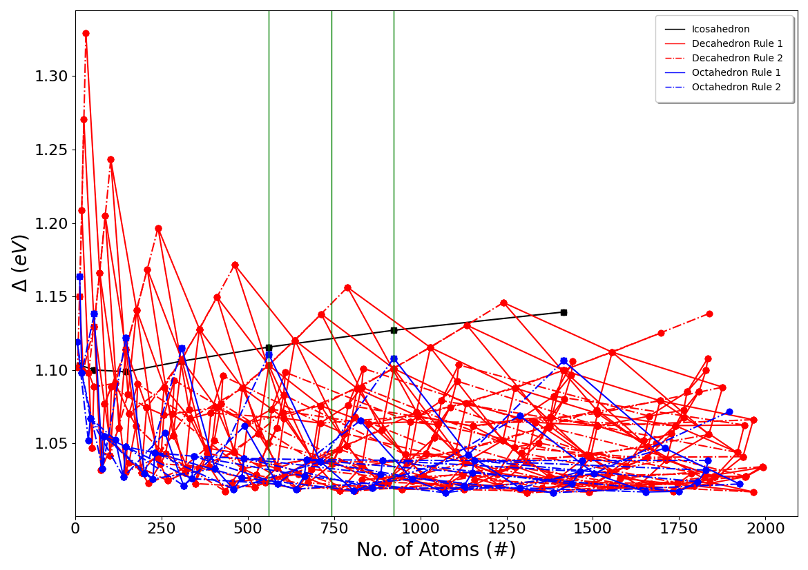

.. _How_To_Run_NISP:

*Interpolation_Script.py* - How to run NISP
###########################################

In this article, we will look at how to run NISP. NISP is run through the ``Interpolation_Script.py`` python script. You can find examples of ``Run.py`` files at `github.com/GardenGroupUO/NISP <https://github.com/GardenGroupUO/NISP>`_ under ``Examples``. Also, you can try out this program by running an example script through a Jupyter notebook. See :ref:`Examples of running NISP <Examples_of_Running_NISP>` to get access to examples of running NISP through this Jupyter notebook!

Running the ``Interpolation_Script.py`` script
**********************************************

We will explain how the ``Interpolation_Script.py`` code works by running though the example shown below:

.. literalinclude:: Interpolation_Script.py
	:language: python
	:caption: Interpolation_Script.py
	:name: Interpolation_Script.py
	:tab-width: 4
	:linenos:

Lets go through each part of the ``Interpolation_Script.py`` file one by one to understand how to use it. 

1) Input information for the interpolation scheme
=================================================

We first load the information required by the interpolation scheme. All this information is loaded as entries into the dictionary called ``input_information``. 

The pieces of information required in ``input_information`` are:

* **Element Type** (*str.*): This is the type of element that the cluster is made up of.
* **Cohesive Energy** (*float*): This is the cohesive energy of the element you are using. See :ref:`How_to_obtain_cohesive_energies` to find about about how to obtain cohesive energies. 
* **Maximum No. of Atoms** (*int*): The number of offspring generated per generation. 
* **Local Optimiser** (*def/str.*): This is a local optimisation method that you will locally optimise clusters with as well as their delta energies. See :ref:`Local_Minimisation_Function` for information about the local optimiser works and is written. 

	* You can also use **VASP to perform DFT local optimisations** on your clusters. Do this by setting the ``'Local Optimiser'`` in ``input_information`` as ``input_information['Local Optimiser'] = 'VASP'``. See :ref:`How_To_VASP_In_NISP` to learn more about how to perform VASP calculations on clusters created using NISP. 
	* You can also elect to **manually enter in the energies of the clusters**. To do this, enter in  ``input_information['Local Optimiser'] = 'Manual Mode'``. See :ref:`How_To_Manually_Enter_Energy_Results_Into_NISP` for more information about how to manually enter in energies for clusters into NISP. 

An example of these parameters in ``Interpolation_Script.py`` is given below:

.. literalinclude:: Interpolation_Script.py
	:language: python
	:tab-width: 4
	:linenos:
	:lineno-start: 4
	:lines: 4-8

2) Output information for the interpolation scheme
==================================================

We then load the information required by the interpolation scheme to plot the results from the interpolation scheme. The sizes of all the clusters that you would like to obtain possible clusters for are also inputted here and given as txt files. 

All this information is loaded as entries into the dictionary called ``output_information``. 

The pieces of information required in ``output_information`` are:

output_information = {}
output_information['Plot upper No of atom limit']   = None
output_information['Plot lower No of atom limit']   = None
output_information['Plot upper delta energy limit'] = None
output_information['Plot lower delta energy limit'] = None
output_information['Sizes to obtain instructions to create clusters for'] = [561,742,923]#[37,38,44,55,147,40,888,1399]

* **Plot upper No of atom limit** (*int*): This is the upper size range that you would like to plot. 
* **Plot lower No of atom limit** (*int*): This is the lower size range that you would like to plot. 
* **Plot upper delta energy limit** (*float*): This is the upper delta energy range that you would like to plot. 
* **Plot lower delta energy limit** (*float*): This is the lower delta energy range that you would like to plot. 
* **Sizes to obtain instructions to create clusters for** (*list of ints*): These are all the sizes of clusters that you would like to obtain possible clusters for, including perfect, open-shell, and close-shell clusters. NISP will include text files that will include how to make all the symmetric and unsymmetric icosahedral, decahedral, and octahedral cluster that contain a particular cluster size. 
* **Filename Prefix** (*str.*): This is the prefix of the name that you want to give to files that are create by the NISP program. This does not need to be given, as there is a default prefix given. The default filename prefix includes the element of the cluster as well as the maximum no. of atoms that the program was run up to. 

An example of these parameters in ``Interpolation_Script.py`` is given below:

.. literalinclude:: Interpolation_Script.py
	:language: python
	:tab-width: 4
	:linenos:
	:lineno-start: 10
	:lines: 10-15

3) The number of CPUs used by the program and the filename prefix of input and output files
===========================================================================================

NISP can run for a long time, especially if you have set **Maximum No. of Atoms** to over 1000 atoms. Therefore, it is possible to run this program for a while. Therefore, it is possible to parallelise this program so that it run a bit faster. This can be set by setting the ``no_of_cpus`` variable. ``no_of_cpus`` must be set to an int. The default value for the ``no_of_cpus`` variable is ``1``. 

Furthermore, you can also give a custom name to the input and output files that you make/are made. This is given in ``filename_prefix``. However, you do not need to do this. If you dont want to have a custom filename, do not include ``filename_prefix`` in your script or set ``filename_prefix = ''``. 

An example of ``no_of_cpus`` in ``Interpolation_Script.py`` is given below:

.. literalinclude:: Interpolation_Script.py
	:language: python
	:tab-width: 4
	:linenos:
	:lineno-start: 17
	:lines: 17-18

Run NISP!
=========

You have got to the end of all the parameter setting stuff. Now on to running NISP. The next part of the ``Interpolation_Script.py`` script tells NISP to run. This is written as follows in the ``Interpolation_Script.py``:

.. literalinclude:: Interpolation_Script.py
	:language: python
	:tab-width: 4
	:linenos:
	:lineno-start: 20
	:lines: 20

Output files that are created by NISP
=====================================

Examples of the plots that are created are shown below. The first of these is the interpolation scheme plot, which shows all the estimated energies of nanoclusters across the size range of nanoclusters that you are measuring across. An example of this for Au nanoclusters, using the RGL potetial with parameters from Baletto *et al.* (`DOI: 10.1063/1.1448484 <https://doi.org/10.1063/1.1448484>`_), is shown below:

The second plot is the same nterpolation scheme plot shown above, but with lines through it at the places that you want to obtain cluster with the particular number of atoms that you desire. 

There are also text documents that contain the delta energies of the various nanoclusters that you calculated, as well as instructions about how to remove atoms from certain nanoclusters in order to get icosahedral, decahedral, and octahedral nanoclusters with the particular number of atoms that you desire. `Click here to see examples of all of these plots and text files <https://github.com/GardenGroupUO/NISP/tree/main/Documentation/source/results>`_. 
