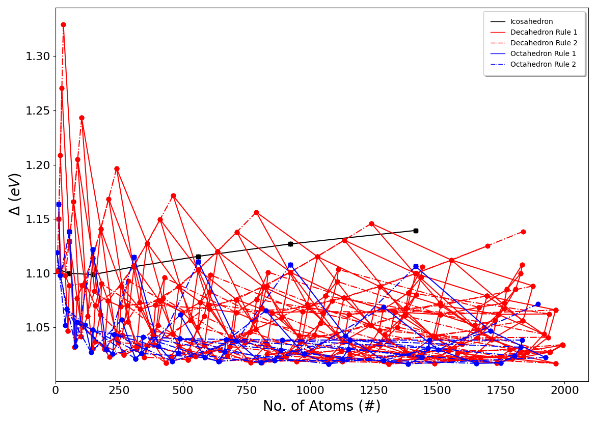

.. The Otago Research Genetic Algorithm for Nanoclusters, Including Structural Methods and Similarity (Organisms) documentation master file, created by
   sphinx-quickstart on Mon Oct  1 08:10:30 2018.
   You can adapt this file completely to your liking, but it should at least
   contain the root `toctree` directive.

Welcome to the Nanocluster Interpolation Scheme Program (NISP) documentation!
#############################################################################

.. image:: https://img.shields.io/badge/Citation-click%20here-green.svg
   :target: https://doi.org/10.1039/C7NR09440J
   :alt: Citation
   

.. image:: https://img.shields.io/pypi/pyversions/NISP
   :target: https://docs.python.org/3/
   :alt: Python Version

.. image:: https://img.shields.io/github/v/release/GardenGroupUO/NISP
   :target: https://github.com/GardenGroupUO/NISP
   :alt: GitHub release (latest by date)

.. image:: https://img.shields.io/pypi/v/NISP
   :target: https://pypi.org/project/NISP/
   :alt: PyPI

.. image:: https://img.shields.io/conda/v/gardengroupuo/nisp
   :target: https://anaconda.org/GardenGroupUO/nisp
   :alt: Conda

.. image:: https://mybinder.org/badge_logo.svg
   :target: https://mybinder.org/v2/gh/GardenGroupUO/NISP/main?urlpath=lab
   :alt: Binder

.. image:: https://img.shields.io/github/license/GardenGroupUO/NISP
   :target: https://www.gnu.org/licenses/agpl-3.0.en.html
   :alt: Licence

.. .. image:: https://img.shields.io/lgtm/grade/python/github/GardenGroupUO/NISP
     :target: https://lgtm.com/projects/g/GardenGroupUO/NISP/context:python
     :alt: LGTM Grade

.. sectionauthor:: Dr. Anna Garden <anna.garden@otago.ac.nz>
.. sectionauthor:: Geoffrey Weal <geoffrey.weal@gmail.com>
.. sectionauthor:: Dr. Andreas Pedersen
.. sectionauthor:: Prof. Hannes Jónsson <hj@hi.is>

Group page: https://blogs.otago.ac.nz/annagarden/

Page to cite with work from: A. L. Garden, A. Pedersen, H. Jónsson, “Reassignment of ‘magic numbers’ of decahedral and FCC structural motifs”, Nanoscale, 10, 5124-5132 (2018), `DOI: 10.1039/C7NR09440J <https://doi.org/10.1039/C7NR09440J>`_

What is this Documentation about?
=================================

This documentation is designed to guide the user to use the Nanocluster Interpolation Scheme Program (NISP) program. 

What is NISP
============

The NISP program is an interpolation scheme that is designed to give an approximate guide for the estimated energies of unsymmetric nanoclusters based on energetic trends between perfect, closed-shell nanoclusters. This program will create all the perfect, close shell icosahedral, decahedral, and octahedral clusters that can be created between 13 atoms and an upper atom number limit. These nanoclusters are locally optimised using either an ASE, an ASE-integrated calculator, or with VASP. After the nanoclusters are locally optimised, the delta energy is obtained for each nanocluster before providing plots and text files that indicate the estimated energies of perfect, closed-shell and unsymmetric nanoclusters and how to remove atoms from the larger perfect closed-shell nanocluster to give unsymmetric nanoclusters with a certain number of atoms. See “Reassignment of ‘magic numbers’ of decahedral and FCC structural motifs” (`DOI: 10.1039/C7NR09440J <https://doi.org/10.1039/C7NR09440J>`_) for more information about how this interpolation scheme works. 

The algorithm was designed by Dr Anna Garden of the University of Otago, Dunedin, New Zealand, and Dr. Andreas Pedersen and Prof. Hannes Jónsson of the University of Iceland. The Github page for this program can be found at `github.com/GardenGroupUO/NISP <https://github.com/GardenGroupUO/NISP>`_. 

Dr. Anna Garden: `blogs.otago.ac.nz/annagarden <https://blogs.otago.ac.nz/annagarden/>`_

Dr. Andreas Pedersen: `https://dk.linkedin.com/in/andreas-pedersen-a847025 <https://dk.linkedin.com/in/andreas-pedersen-a847025>`_

Prof. Hannes Jónsson: `english.hi.is/staff/hj <https://english.hi.is/staff/hj>`_

Try Organisms before you Clone/Pip/Conda (on Binder/Jupter Notebooks)!
======================================================================

If you are new to the NISP program, it is recommended try it out by running NISP live on our interactive Jupyter+Binder page before you download it. On Jupyter+Binder, you can play around with the NISP program on the web. You do not need to install anything to try NISP out on Jupyter+Binder.

Click the Binder button below to try NISP out on the web! (The Binder page may load quickly or may take 1 or 2 minutes to load)

.. image:: https://mybinder.org/badge_logo.svg
   :target: https://mybinder.org/v2/gh/GardenGroupUO/NISP/main?urlpath=lab
   :alt: Binder

Installation
============

It is recommended to read the installation page before using the NISP program. See :ref:`Installation: Setting Up NISP and Pre-Requisites Packages <Installation>` for more information. Note that you can install NISP through ``pip3`` and ``conda``. 

Output files that are created by NISP
=====================================

Examples of the plots that are created are shown below. The first of these is the interpolation scheme plot, which shows all the estimated energies of nanoclusters across the size range of nanoclusters that you are measuring across. An example of this for Au nanoclusters, using the RGL potetial with parameters from Baletto *et al.* (`DOI: 10.1063/1.1448484 <https://doi.org/10.1063/1.1448484>`_), is shown below:

The second plot is the same nterpolation scheme plot shown above, but with lines through it at the places that you want to obtain cluster with the particular number of atoms that you desire. 

.. image:: results/Au_Max_Size_2000_Interpolation_Scheme_with_lines.png
   :width: 400
   :alt: Interpolation Scheme with lines

There are also text documents that contain the delta energies of the various nanoclusters that you calculated, as well as instructions about how to remove atoms from certain nanoclusters in order to get icosahedral, decahedral, and octahedral nanoclusters with the particular number of atoms that you desire. `Click here to see examples of all of these plots and text files <https://github.com/GardenGroupUO/NISP/tree/main/Documentation/source/results>`_. 

Table of Contents
=================

.. toctree::
   :maxdepth: 2

   How_NISP_Works
   Installation
   How_To_Run_NISP
   Local_Minimisation_Function
   How_To_VASP_In_NISP
   How_To_Manually_Enter_Energy_Results_Into_NISP
   How_to_obtain_cohesive_energies
   Examples_of_Running_NISP
   Example_data_from_NISP
   HelpfulPrograms_Subsidiary_Programs
   NISP_Files
   genindex
   py-modindex

Indices and tables
==================

* :ref:`genindex`
* :ref:`modindex`